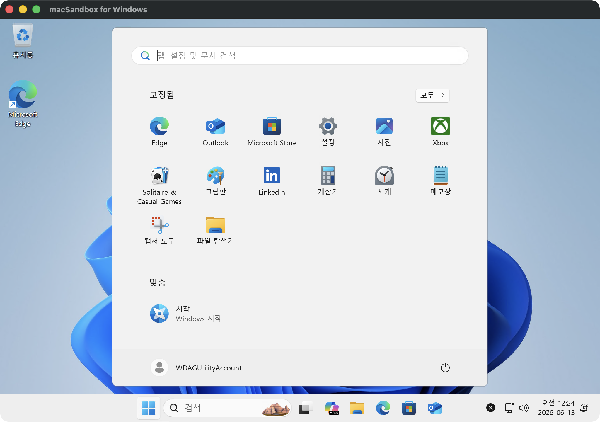
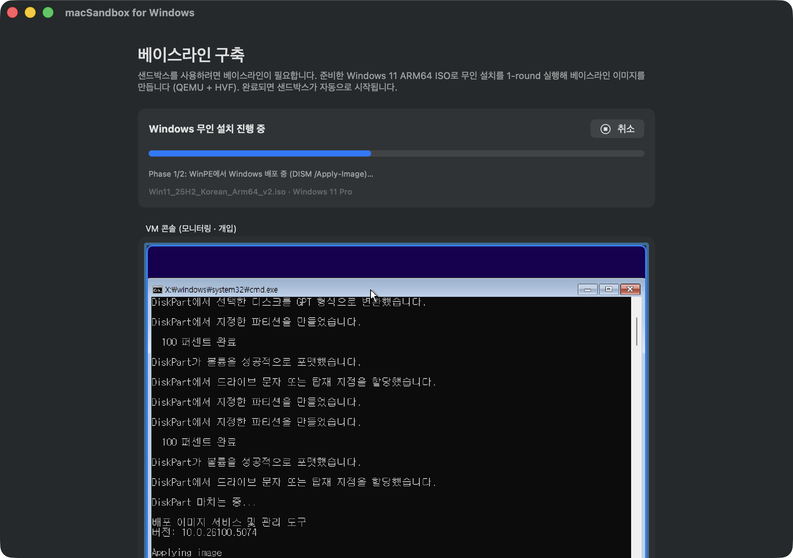
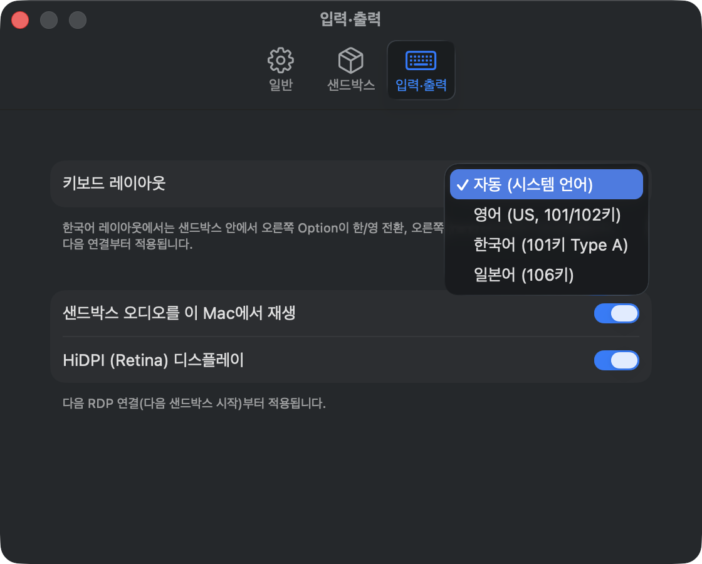
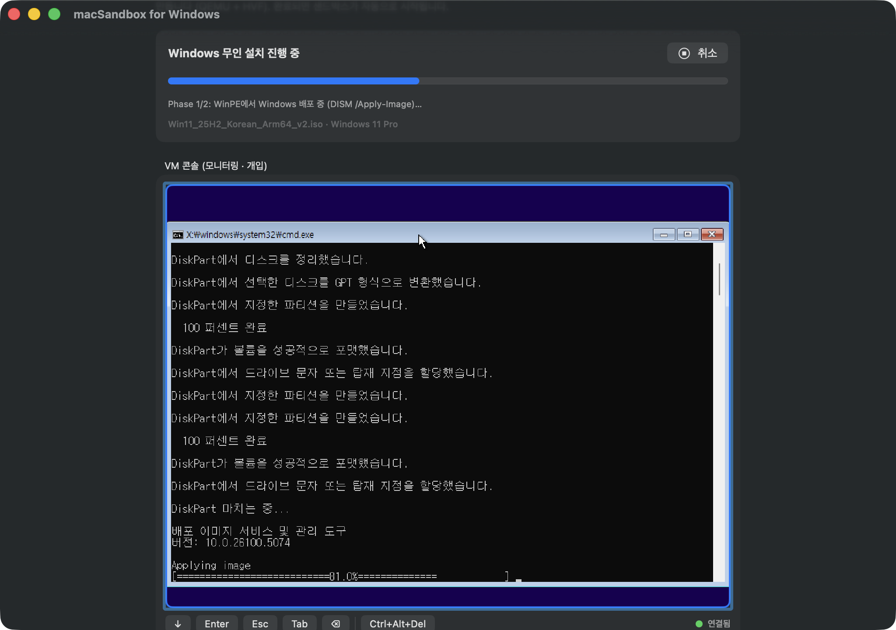
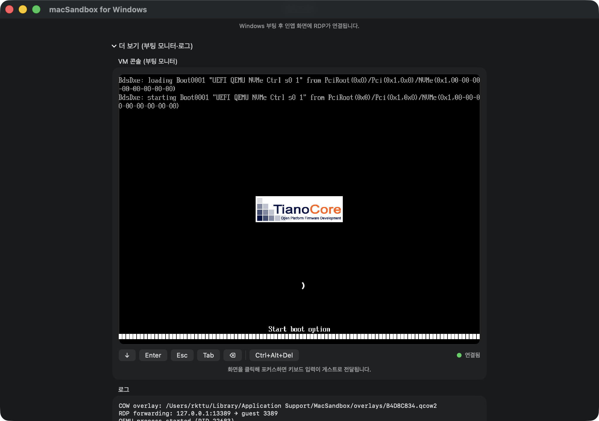
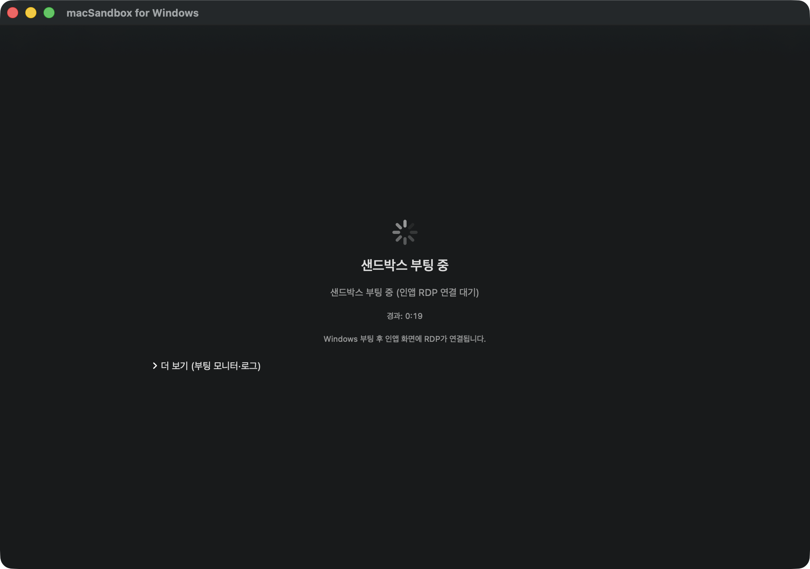
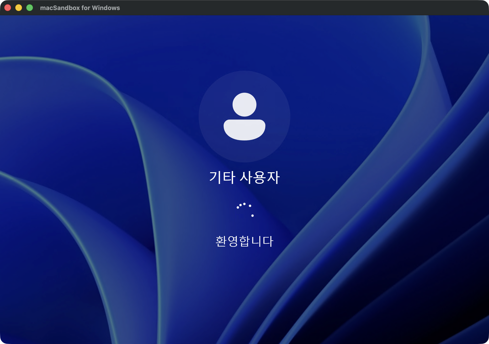
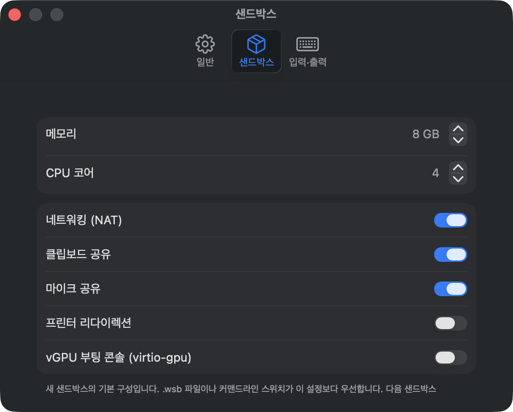
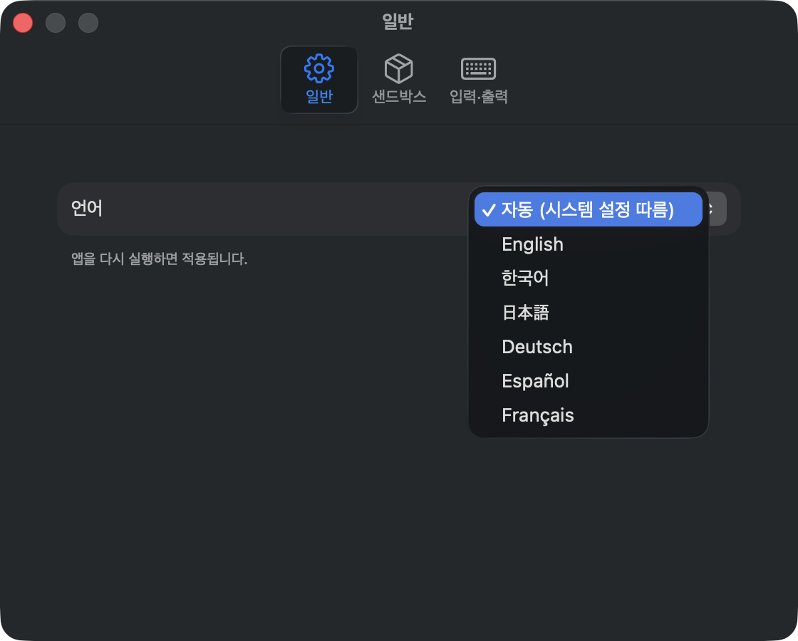
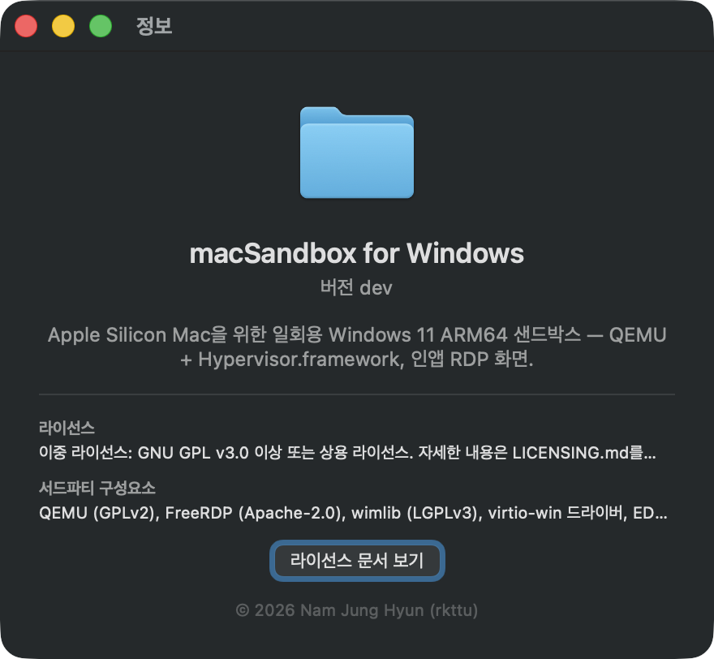

# Disposable Windows, on your Mac

**macSandbox for Windows** brings the Windows Sandbox experience to Apple
Silicon Macs: boot a throwaway **Windows 11 ARM64** environment in seconds,
use it like a normal desktop inside the app, and have **every change discarded
on exit**.



## How it works

1. **Build a base image once** — point the app at your own Windows 11 ARM64
   ISO. A fully unattended, deterministic **WinPE + DISM** deployment installs
   Windows with virtio drivers injected, Microsoft Edge's first-run experience
   disabled, and inbox bloatware (games, media utilities, promos) removed. No
   clicks, no prompts.
2. **Launch disposable sandboxes** — each session boots a copy-on-write
   overlay on **QEMU + Hypervisor.framework**, and connects automatically to an
   **in-app RDP view** (libfreerdp) for crisp HiDPI display, trackpad
   scrolling, pinch-to-zoom, clipboard, shared folders, printing, and audio.
3. **Close the window** — the overlay is destroyed. Nothing persists.



## Highlights

| | |
|---|---|
| 🗑 **Disposable** | Fresh Windows every launch; changes never persist |
| ⚙️ **`.wsb` compatible** | Reuses the Windows Sandbox configuration schema — memory, CPU, networking, mapped folders, logon command |
| 📋 **Deep integration** | Two-way text & file clipboard, `\\tsclient` folder auto-mount, CUPS printer redirection, speaker/microphone |
| 🌐 **Localized** | English · 한국어 · 日本語 · Deutsch · Español · Français, with Korean/Japanese keyboard handling (right Option = 한/영) |
| 🧾 **License-aware** | Ships no Windows OS or keys; a licensing checklist is confirmed before every base image build |



## Screenshots

| | |
|---|---|
|  |  |
| *Fully unattended installation — watch it, never click it* | *Boot monitor with live diagnostics* |
|  |  |
| *Booting a fresh disposable sandbox* | *Automatic sign-in to the in-app RDP session* |
|  |  |
| *Per-sandbox defaults: memory, CPU, redirections* | *Six display languages, following your system* |
|  | |
| *Dual licensing, third-party notices at a glance* | |

## Get started

```sh
brew install freerdp wimlib
git clone https://github.com/yourtablecloth/macSandbox.git
cd macSandbox
swift build && .build/debug/MacSandbox
```

Requirements: Apple Silicon Mac, macOS 14+, your own licensed Windows 11
ARM64 ISO, ~24 GB free disk space for the one-time baseline build.

See the [Help guide](help/) for day-to-day usage, the
[README](https://github.com/yourtablecloth/macSandbox#readme) for packaging
(`scripts/package_app.sh`) and command-line switches, and the
[architecture guide](https://github.com/yourtablecloth/macSandbox/blob/main/ARCHITECTURE.md).

## Licensing

Dual-licensed: **GNU AGPL-3.0-or-later** (open-source edition) or a
**commercial license** — see
[LICENSING.md](https://github.com/yourtablecloth/macSandbox/blob/main/LICENSING.md).
Bundled QEMU, EDK2 firmware and linked FreeRDP remain under their own
licenses.

> macSandbox for Windows does **not** include Windows. You must provide your
> own Windows 11 ARM64 ISO and hold a valid license for each Windows instance
> you run. This is an independent project, not affiliated with or endorsed by
> Microsoft. Windows is a trademark of the Microsoft group of companies.

## Support

Bug reports and feature requests are accepted **only via
[GitHub Issues](https://github.com/yourtablecloth/macSandbox/issues)** — there is no
e-mail support channel.
