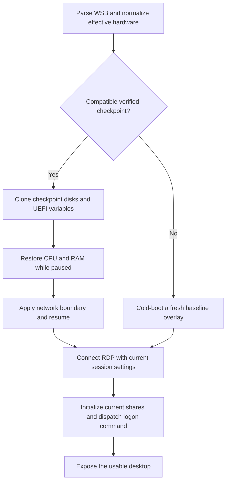

# Warm-start feasibility and WSB compatibility

Status: research complete; Windows proof of concept pending. Assessed on September 6, 2026 against macSandbox commit `43420147e713e7f68cef28a998d8ea4eb686d911` and bundled QEMU 10.2.1.

Tracking issue: [#7: Warm-start PoC with WSB-compatible session initialization](https://github.com/yourtablecloth/macSandbox/issues/7).

Research branch: [`docs/warm-start-feasibility`](https://github.com/yourtablecloth/macSandbox/tree/docs/warm-start-feasibility). Detailed observations: [VM state probe evidence](vm-state-probe-evidence.md).

## Decision under evaluation

macSandbox currently creates a disposable disk overlay and cold-boots Windows for each session. A reusable saved state could avoid some of that startup work while preserving the existing `.wsb` interface. The feasible design selects a saved state compatible with the requested virtual hardware, then applies the current session's settings. Requests without a compatible saved state retain the cold-boot path.

This research does not establish a Windows startup speedup or select a production implementation. The current NVMe device blocks QEMU state saving. A substitute virtio-blk device passed a limited firmware-stage save/restore probe, but Windows boot and resume with that controller remain unverified.

Microsoft's [Windows Sandbox design article](https://techcommunity.microsoft.com/t5/Windows-Kernel-Internals/Windows-Sandbox/ba-p/301849) describes snapshot and clone techniques that preserve memory, CPU, and device state. That provides architectural precedent, not evidence that macSandbox can reuse Microsoft's implementation or match its performance.

## Three different persistence mechanisms

**Windows hibernation (S4)** saves OS memory to `hiberfil.sys`; the Windows loader and drivers perform resume. Guest support is unknown until `powercfg /a` and an actual hibernate/resume cycle are checked on the intended Windows ARM64 build. The QEMU NVMe migration blocker does not itself rule out guest S4, because this path does not serialize the QEMU NVMe controller. Hardware changes can invalidate a hibernation image. See [Microsoft's system sleeping states](https://learn.microsoft.com/en-us/windows-hardware/drivers/kernel/system-sleeping-states).

**Windows Fast Startup** logs off user sessions and saves kernel state. It could preserve a fresh user logon while reducing kernel startup work if the guest supports it. It does not retain an initialized user desktop. It has not been tested here. See [Microsoft's power-state documentation](https://learn.microsoft.com/en-us/windows/win32/power/system-power-states).

**QEMU saved-state restore** serializes CPU, RAM, and supported virtual-device state. It does not require guest S4 support. QEMU requires a compatible device configuration at restore. An external migration stream does not automatically capture the contents of the disk images; those files must be preserved at the same checkpoint. QEMU's internal `savevm` snapshots additionally require suitable snapshot-capable writable storage. See [migration requirements](https://www.qemu.org/docs/master/devel/migration/main.html) and [VM snapshots](https://www.qemu.org/docs/master/system/images.html#vm-snapshots).

## Verified constraints in the current runtime

The [runtime](../../src/MacSandbox/Core/QEMURuntime.swift) uses ARM `virt`, GICv3, HVF, `-cpu host`, an NVMe system disk, RAW UEFI variables, USB input, optional USB configuration media, virtio-net, and either ramfb or virtio-gpu. Enabling audio input also changes the HDA device topology.

The September 6 probes established the following boundaries:

| Probe | Observed result | Interpretation |
| --- | --- | --- |
| Paused ARM HVF minimal VM, 2 vCPUs, 128 MiB RAM | File migration completed; a fresh process restored to `prelaunch` | Basic state serialization is available in this HVF build; no guest workload ran |
| Firmware-stage VM with the current NVMe device class | Both `savevm` and file migration rejected NVMe as non-migratable | The current system-disk controller blocks QEMU saved-state adoption |
| Same probe with virtio-blk replacing NVMe | File migration completed; a fresh process restored to `paused` and resumed to `running` | This device combination passed a firmware-stage probe; Windows behavior remains unknown |
| Internal `savevm` after the controller substitution | Rejected writable RAW `pflash1` | Changing the storage controller alone does not make internal snapshots usable |

The [QEMU 10.2.1 NVMe source](https://github.com/qemu/qemu/blob/v10.2.1/hw/nvme/ctrl.c#L9505) explicitly marks its VM state as unmigratable. The raw UEFI restriction was independently observed during the probe. These results support evaluating external state files with coordinated disk copies; they do not prove that internal snapshots are impossible after further storage changes.

The probes used disposable blank disks and no Windows image. They did not test Windows drivers, RDP, actual microphone capture, a formatted configuration disk, vGPU, or a performance improvement. The [evidence record](vm-state-probe-evidence.md) includes configuration differences and observed errors.

## WSB settings across the restore boundary

The current [WSB parser](../../src/MacSandbox/Core/WSBConfig.swift) produces a `SandboxConfig`. [QEMU arguments](../../src/MacSandbox/Core/QEMURuntime.swift), [RDP connection settings](../../src/MacSandbox/Views/RDPHostView.swift), and the [guest logon script](../../src/MacSandbox/Core/SandboxRunner.swift) consume different parts of that configuration. Compatibility is assessed against the [currently implemented subset](../../WSB-SUPPORT.md), not the full Microsoft schema.

| Setting | Current application point | Proposed handling and remaining validation |
| --- | --- | --- |
| `MemoryInMB` | QEMU `-m`, after host-aware clamping | Match the effective RAM size in the saved-state key; cold-boot on a mismatch |
| CPU count (`CpuCores` extension / `--cpus`) | QEMU `-smp`, after clamping | Match effective vCPU count and topology; cold-boot on a mismatch |
| `VGpu` | Choice of ramfb or virtio-gpu | Separate compatible state profiles; do not substitute devices during restore |
| `Networking` | User-mode network backend and `restrict=on` | Install the requested policy before any resumed guest execution; verify restored backend state cannot reinstate external access |
| `MappedFolders` and `SandboxFolder` | New RDP drive redirections, then guest links | Supply only this run's folders; wait for redirections before creating links or running the command |
| `ClipboardRedirection` | FreeRDP connection setup | Recreate the RDP connection with the current flag and verify both directions |
| `PrinterRedirection` | FreeRDP connection setup | Recreate the RDP connection with the current flag; verify devices after reconnect |
| `AudioInput` | FreeRDP capture flag and QEMU HDA device presence | Initially key on current HDA topology; evaluate a fixed topology with per-connection microphone control separately |
| `LogonCommand` | HKLM Run launcher and configuration disk | Preserve a fresh logon, or introduce explicit per-run dispatch when restoring a logged-on desktop |

Networking and RDP settings are candidate session settings, not proven restore-compatible settings. For an initial PoC, differing network policies can conservatively use separate profiles or cold boot until backend-state behavior is verified. Existing limitations, including unenforced mapped-folder `ReadOnly` and unsupported video input, remain outside this optimization's acceptance claims. See the [official WSB schema](https://learn.microsoft.com/en-us/windows/security/application-security/application-isolation/windows-sandbox/windows-sandbox-configure-using-wsb-file) for the broader contract.

## Capture point and session initialization

Start with a **logged-off, RDP-ready checkpoint**. Wait for provisioning to finish, disable bootstrap auto-logon as today, and capture a stable state before a user RDP session starts. Restoring this state can skip firmware and kernel startup while retaining a fresh WDAGUtilityAccount logon and the existing logon-script trigger. User-profile and desktop initialization costs remain.

A **logged-on desktop checkpoint** could avoid additional initialization, but it changes the execution contract. Reconnecting to a restored RDP session is not a fresh logon. The current HKLM Run entry cannot serve as a guaranteed resume hook. [Microsoft documents Run entries as logon-triggered](https://learn.microsoft.com/en-us/windows/win32/setupapi/run-and-runonce-registry-keys).

For that later design, use a guest control path installed before capture. A host-generated run ID identifies the session initialization request. Wait for current RDP shares, create guest links, then dispatch the configured command and return its status. RDP reconnects for the same run ID must not dispatch the command again. If a crash occurs after dispatch and execution status is unknown, do not blindly retry an arbitrary command that may already have changed a host share.

The current optional FAT configuration disk cannot simply be overwritten underneath a restored guest: cached filesystem data and saved USB state may describe the previous medium. Use a fixed device topology and a tested eject/remount protocol, or replace this delivery path with an explicit control channel. The candidate protocol must also work with external networking disabled. QEMU documents [removable-device limitations for VM snapshots](https://www.qemu.org/docs/master/system/images.html#vm-snapshots).

The proposed runtime flow separates hardware compatibility from per-run initialization:

## Checkpoint lifecycle and compatibility

Retain the existing cold baseline as a recovery source. Prepare a separate clean warm checkpoint before exposing user folders or running a user-supplied command. Never promote the end of a disposable user session into the reusable checkpoint.

For external QEMU state files, stop guest execution, settle and flush outstanding storage I/O, and preserve RAM/device state, every writable disk, and UEFI variables as one generation. Publish a manifest only after all files and the restore check succeed. A memory stream plus disks from another point in time is not a valid checkpoint. On every run, use fresh writable disk overlays or clones and a matching UEFI copy; the reusable generation remains immutable. Windows S4 likewise needs a fresh writable clone so consuming or modifying `hiberfil.sys` does not change the reusable source. See [QEMU's description of complete VM state](https://www.qemu.org/docs/master/system/images.html#vm-snapshots).

A proposed compatibility key includes the baseline generation and Windows build, guest driver/agent versions, QEMU build, machine version, firmware hashes, host CPU features, tested macOS/HVF environment, effective RAM/vCPU topology, and guest-visible devices and identifiers. Initially invalidate on a change to any untested component. A versioned `virt-10.2` machine exists in the installed QEMU; the current unversioned `virt` alias does not provide a cross-release compatibility guarantee. See [QEMU's versioned ARM machine documentation](https://www.qemu.org/docs/master/system/arm/virt.html).

Start with one common hardware profile and cold-boot uncommon configurations. Additional profiles trade disk space and rebuild time for coverage; add them only if measured use justifies a bounded cache. Restore also loads memory from disk, so the benefit depends on the saved working set and host I/O behavior.

Invalidate a checkpoint after baseline rebuilds, credential changes, incompatible updates, or failed validation. A restore failure before session initialization can discard the attempt and cold-boot with the same WSB configuration. After a user command starts, failure handling must preserve its execution status instead of automatically replaying it. Verify clock correction, fresh network/RDP connections, access protection for memory-state files, and absence of previous-run artifacts as part of the Windows PoC.

## Follow-up work and acceptance criteria

The linked issue tracks implementation experiments. A go/no-go decision requires actual Windows results in addition to the existing firmware-stage evidence.

1. **Establish guest and startup measurements.** Record Windows edition/build, firmware, drivers, effective RAM/vCPUs, and `powercfg /a`. Measure configuration-media preparation, RDP readiness, interactive desktop readiness, and session-command dispatch separately for the current cold path.
2. **Evaluate guest S4 and Fast Startup.** If supported, test each on a disposable clone with identical hardware. Record whether resume succeeds, which initialization costs remain, and whether the existing logon trigger runs as intended.
3. **Evaluate Windows on migration-capable storage.** Test ARM64 virtio-blk boot-driver installation and bootability on a disposable image. Do not replace the user's working NVMe baseline as an experimental prerequisite.
4. **Capture and repeatedly restore a logged-off checkpoint.** Exercise coordinated disk/UEFI preservation, new QEMU processes, new overlays, and successful Windows/RDP operation. Require at least ten independent successful restores for the initial PoC report; this is a proposed gate, not a completed test.
5. **Exercise WSB variants.** Verify networking enable/disable before guest execution, changed shares and guest paths, clipboard/printer/microphone flags, logon-command ordering, and no duplicate command on RDP reconnect. Verify memory/vGPU/CPU mismatches select an appropriate checkpoint or cold boot without silently changing the request.
6. **Exercise invalidation and failure recovery.** Test missing/corrupt state, mismatched disk/UEFI generations, incompatible component versions, interrupted capture, and restore failure. Confirm clean disposal and preservation of command execution status.
7. **Compare performance and select a path.** Report cold and restored medians and ranges over repeated runs on the same host and effective configuration. Include checkpoint size, preparation time, host-memory impact, and storage-cache conditions. Choose a production path only after a measured improvement and the compatibility checks above.

The current assessment supports a staged PoC with cold-boot fallback. It does not establish guest hibernation support, Windows resume reliability, or a target startup time.
